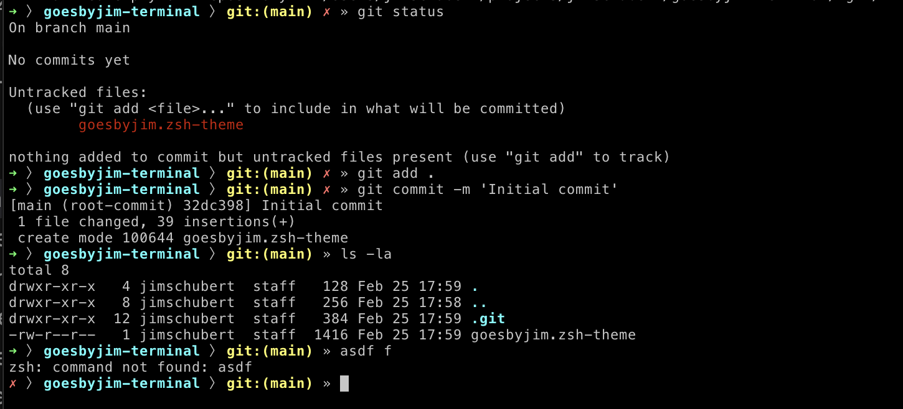
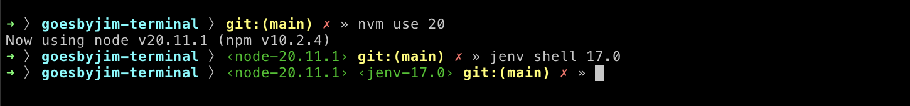

# goesbyjim-terminal

This is a simple theme for oh-my-zsh, loosely based on the mira theme.

## goesbyjim.zsh-theme

The theme supports git prompt and red x for failed command and dirty workspace.



The theme also lists the nvm or jenv versions if not `system`.



## Installation

Download:

```shell
git clone --quiet https://github.com/jimschubert/goesbyjim-terminal ~/.oh-my-zsh/custom/themes/goesbyjim
```

Set the theme:
```shell
omz theme set goesbyjim/goesbyjim
```

Reload:

```shell
omz reload
```
